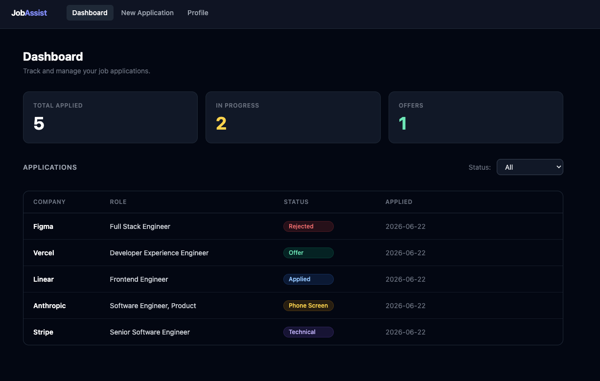

# Job Application Assistant

A web app to track job applications, tailor resumes, generate cover letters, and prep for interviews — powered by Claude AI.



## Prerequisites

- Python 3.11+
- Node.js 18+
- Docker
- An [Anthropic API key](https://console.anthropic.com/)

## Setup

### 1. Clone and configure secrets

```bash
git clone <repo-url>
cd job-assistant

cp backend/.env.example backend/.env
# Edit backend/.env and add your ANTHROPIC_API_KEY
```

### 2. Start the database

```bash
docker compose up -d
```

### 3. Backend

```bash
cd backend
pip install -r requirements.txt
uvicorn app.main:app --reload
```

API runs at `http://localhost:8000`. Tables are created automatically on first startup.

### 4. Frontend

```bash
cd frontend
npm install
npm run dev
```

App runs at `http://localhost:5173`.

---

Or use the Makefile shortcuts:

```bash
make backend   # starts DB + backend
make frontend  # starts frontend
make test      # run frontend tests
```

## Testing

```bash
make test            # run all tests (backend + frontend)
make test-watch      # backend: re-run on file changes
make test-frontend   # frontend only
```

### Backend

The backend has a pytest suite that runs against an in-memory SQLite database — no live Postgres or Anthropic API key needed.

#### Setup

```bash
make install-dev   # installs pytest, httpx, aiosqlite alongside app deps
```

#### Running backend tests

```bash
cd backend
python -m pytest                                     # all tests
python -m pytest tests/test_applications.py          # one file
python -m pytest -k "csv"                            # filter by keyword
python -m pytest -v                                  # verbose output
```

#### Guidelines for new backend tests

- **Place tests in `backend/tests/`** in a file named `test_<feature>.py`.
- **Use the `client` fixture** for route tests — it wires the app to an isolated in-memory DB and tears it down after each test.
- **Mock Claude calls** with `unittest.mock.patch` + `AsyncMock` — never make real API calls in tests.
- **Keep tests independent** — each test gets a fresh database; do not share state across tests.
- **Name tests descriptively**: `test_<action>_<condition>` (e.g. `test_create_application_missing_company`).

### Frontend

The frontend has a test suite built with [Vitest](https://vitest.dev/) and [React Testing Library](https://testing-library.com/).

```bash
cd frontend
npm test               # watch mode
npm run test:coverage  # with coverage report
```

Tests live in `frontend/src/test/` and cover components (`StatusBadge`, `QuestionCard`, `ApplicationTable`), the `useToast` hook, and the `Dashboard` page.

## Contributing

All development work should be done on a feature branch and submitted as a pull request — do not push directly to `main`.

```bash
git checkout -b feat/your-feature-name
# make changes
make test          # confirm tests pass before opening a PR
git push -u origin feat/your-feature-name
gh pr create
```

## Features

- **Profile** — store your LinkedIn, GitHub, and multiple resumes
- **Application Tracker** — manage applications through a status pipeline (Applied → Phone Screen → Technical → Offer / Rejected)
  - Search by company or role
  - Sort by any column (Company, Role, Status, Applied date), defaulting to most recent first
  - Import applications from a CSV file (tab or comma delimited, Excel-compatible)
  - Export the current filtered/sorted view to a CSV file
- **Resume Tailoring** — pick a resume, tailor it to a job description with keyword analysis
- **Cover Letter Generation** — generate cover letters in professional, conversational, or enthusiastic tone
- **Interview Prep** — generate behavioral, technical, and culture-fit questions tailored to your resume

## API

Interactive docs at `http://localhost:8000/docs`

| Method | Endpoint | Description |
|--------|----------|-------------|
| GET/PUT | `/profile` | Get or update profile |
| GET/POST | `/resumes` | List or create resumes |
| GET/PUT/DELETE | `/resumes/{id}` | Manage a resume |
| POST | `/resume/tailor` | Tailor a resume to a job description |
| POST | `/cover-letter/generate` | Generate a cover letter |
| GET/POST | `/applications` | List or create applications |
| GET/PUT/DELETE | `/applications/{id}` | Manage an application |
| POST | `/applications/import-csv` | Bulk import applications from a CSV file |
| POST | `/interview/prep` | Generate interview questions |
| GET | `/health` | Health check |
